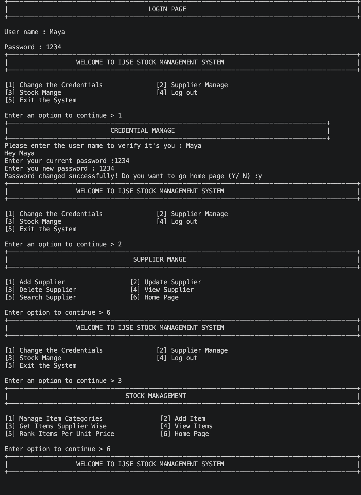

# IJSE Stock Management System – CLI Application

A **console-based (CLI) Stock Management System** developed in pure **Java** as a Programming Fundamentals (PRF) coursework project.  
Data is managed in-memory using arrays (no database). The application provides a menu-driven interface for managing suppliers, item categories, and stock items.

---

## Features

### Authentication
- Login with username & password
- Change credentials (username verification + password update)
- Logout

### Supplier Management
- Add Supplier
- Update Supplier
- Delete Supplier
- View all Suppliers
- Search Supplier

### Stock Management
- Manage Item Categories (add categories)
- Add Item (linked to supplier & category)
- View Items (supplier-wise)
- View all Items
- Rank Items by Unit Price (ascending)

### System
- Clear console between screens
- Exit the system safely

---

## Screenshots

### Application Demo (CLI)


---

## Tech Stack

| Component     | Technology                |
|---------------|---------------------------|
| Language      | Java                      |
| Interface     | Console / CLI             |
| Data Storage  | In-memory arrays          |
| IDE           | IntelliJ IDEA             |
| Type          | Programming Fundamentals coursework |

---

## Default Login Credentials

| Field    | Value  |
|----------|--------|
| Username | `Maya` |
| Password | `1234` |

---

## How to Run

### Option 1 – Compile & Run (Terminal)

```bash
# Navigate to the source folder
cd "Course work in PRF"

# Compile
javac Demo.java

# Run
java Demo
```

### Option 2 – Using IDE

1. Open the project in **IntelliJ IDEA** (or any Java IDE).
2. Open `Demo.java`.
3. Run the `main` method.

---

## Project Structure

```
PRF-Course-Work-Stock-Management-System-CLI-Application/
├── Course work in PRF/
│   └── Demo.java          # Main application (all logic)
├── out/                   # Compiled classes
└── README.md
```

---

## Menu Flow

```
LOGIN PAGE
    ↓
HOME PAGE
    ├── [1] Change the Credentials
    ├── [2] Supplier Manage
    │       ├── [1] Add Supplier
    │       ├── [2] Update Supplier
    │       ├── [3] Delete Supplier
    │       ├── [4] View Supplier
    │       ├── [5] Search Supplier
    │       └── [6] Home Page
    ├── [3] Stock Manage
    │       ├── [1] Manage Item Categories
    │       ├── [2] Add Item
    │       ├── [3] Get Items Supplier Wise
    │       ├── [4] View Items
    │       ├── [5] Rank Items Per Unit Price
    │       └── [6] Home Page
    ├── [4] Log out
    └── [5] Exit the System
```

---

## Data Structures Used

| Data            | Structure                          | Purpose                          |
|-----------------|------------------------------------|----------------------------------|
| Suppliers       | `String[][]` (ID, Name)            | Store supplier records           |
| Categories      | `String[]`                         | Store item categories            |
| Items           | `String[][]` (6 columns)           | Supplier ID, Code, Desc, Price, Qty, Category |

---

## Author

**G. D. Mayantha**  
GitHub: [Mayantha2003](https://github.com/Mayantha2003)

**Course:** Programming Fundamentals (PRF) – IJSE HDSE

---

## License

This project is intended for educational / coursework purposes.
